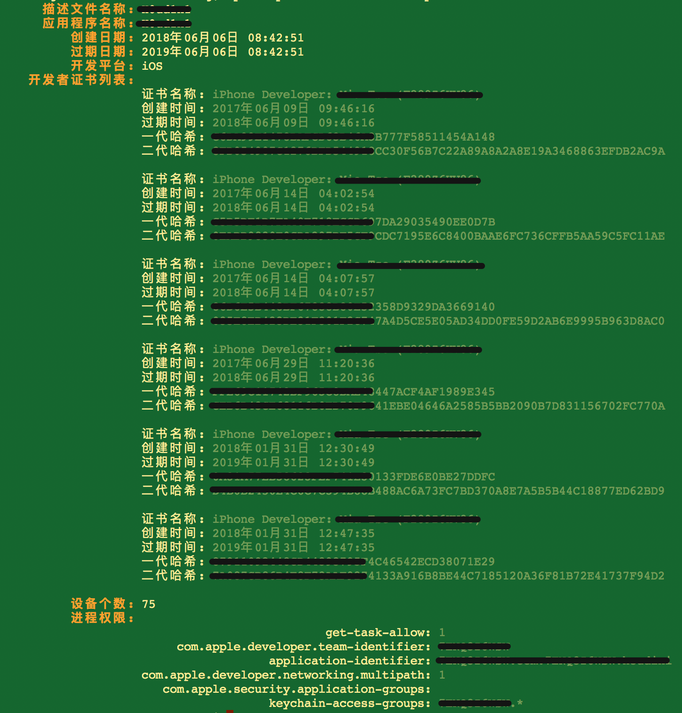
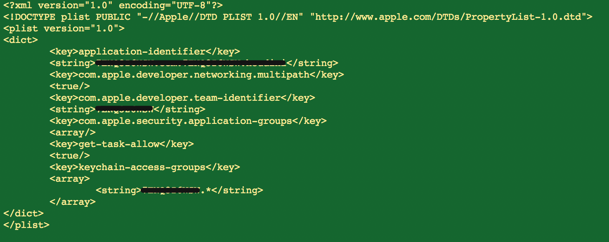
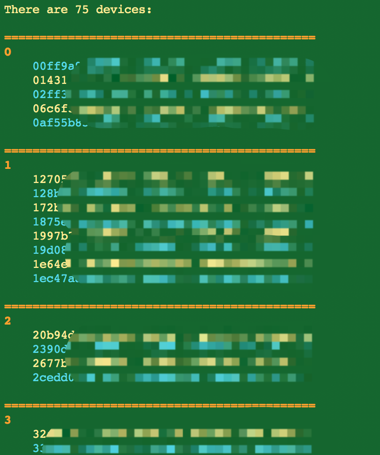

# MobileProvisionTool

> A demo for [CommandLine](https://github.com/Magic-Unique/CommandLine)

## USAGE

### Print Informations

```shell
$ mptool print embedded.mobileprovision
```
You will get:



**For English**

```shell
$ mptool print embedded.provision --en
```

### Create Entitlements

```shell
$ mptool entitlements -p -i embedded.mobileprovision -o entitlements.plist
```

You will get:



### Devices

```shell
$ mptool devices list --print -i embedded.mobileprovision
```

You will get:



## LICENSE

MIT.